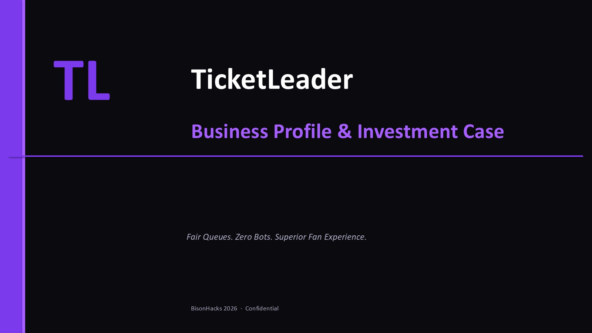

# TicketLeader

> **Fair queues. Zero bots. Superior fan experience.**

Built for BisonHacks 2026 by **Mason Brogden · Daniel Adewale · Solomon Shasanmi · Joseph Lewis**


### 🌐 [Live Site → ticket-leader.vercel.app](https://ticket-leader.vercel.app/live-queue)

---

## Three Things That Set Us Apart

| | Feature | What It Does |
|---|---|---|
| 🤖 | **Multi-Layer Bot Detection** | Behavioral tracking, IP flagging, AI trivia gate, and WebAuthn biometrics — bots don't get in |
| 🏟️ | **3D Stadium Experience** | Interactive 80,000-seat viewer with seat finder, accessibility routing, parking guidance, and spoken TTS directions |
| 📊 | **Trust Score Queue** | Fans earn Bronze → Platinum rank by playing trivia and polls while they wait — human behavior is rewarded |

---

## Pitch Deck

[](./docs/deck/TicketLeader-small.pdf)

[TicketLeader Deck (PDF)](./docs/deck/TicketLeader-small.pdf) - 15-slide investor deck with live demo videos, market analysis, break-even by stadium, and competitive moat.

---

## Tech Stack

| Layer | Technology |
|-------|-----------|
| Frontend | React 19, Vite 7, Three.js, React Three Fiber, Socket.IO Client |
| Backend | Node.js, Express, MongoDB, Mongoose, Socket.IO |
| AI | Google Gemini 2.5 Flash |
| 3D | Three.js, @react-three/fiber, @react-three/drei |
| Auth | JWT, bcrypt, WebAuthn |
| DevOps | Docker, Docker Compose, Nginx, Render, Vercel, MongoDB Atlas |

---

## Team

| Name | GitHub |
|------|--------|
| Solomon Shasanmi | [@TheeGreenGenie](https://github.com/TheeGreenGenie) |
| Joseph Lewis | [@joslew22](https://github.com/joslew22) |
| Daniel Adewale | [@danieladewale](https://github.com/danieladewale) |
| Mason Brogden | [@masonbrogden](https://github.com/masonbrogden) |

---

## Project Workflow

```
feature branch → PR → review → merge to main → auto-deploy
     │                                               │
     └── Vercel (frontend)        Render (backend) ──┘
                  └────── MongoDB Atlas (database) ──┘
```

1. Each feature developed on its own branch
2. Merged into `main` via pull request
3. Render auto-deploys backend on push to `main`
4. Vercel auto-deploys frontend on push to `main`
5. MongoDB Atlas persists all data in the cloud

---

## Quick Start (Docker)

```bash
git clone https://github.com/TheeGreenGenie/ticket_leader.git
cd ticket_leader
cp server/.env.example server/.env   # fill in your keys
docker compose up --build
```

App → `http://127.0.0.1:4001` · API → `http://127.0.0.1:5001/api/health`

---

## Technical Deep-Dive

For full architecture, API reference, bot detection internals, trust score algorithm, 3D stadium implementation, and deployment config:

📄 **[TECHNICAL.md](./TECHNICAL.md)**

---

## AI Logs Index
Supporting planning docs are indexed in [ai_logs/index.txt](./ai_logs/index.txt)
 (one path per line).

